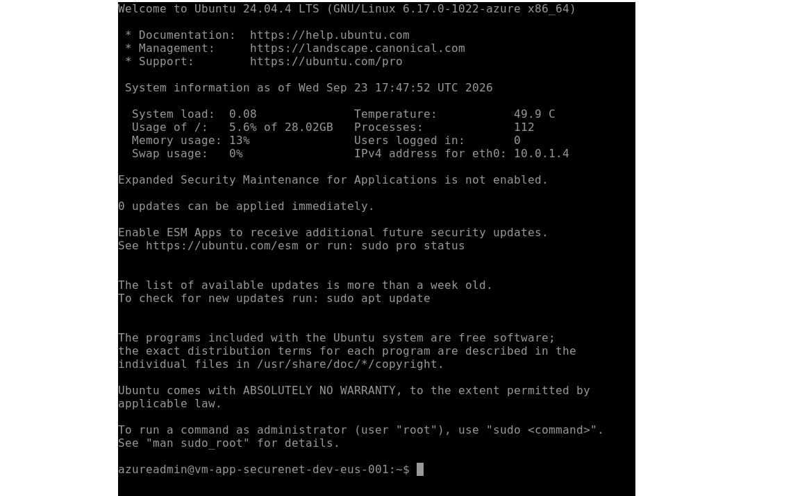

# Evidence — Network segmentation and administrative access

**Date:** 2026-09-23
**Environment:** dev (`rg-securenet-dev-eus-001`, East US)

## What was tested

Two security claims made by this architecture:

1. Administrators can manage the workload VM **without any public IP** on it.
2. The application subnet **cannot reach** the management subnet.

## Test 1 — Administrative access without a public IP

Connected to `vm-app-securenet-dev-eus-001` through Azure Bastion, from the browser.
The VM exposes no public IP address; the session is established over the private
network from `AzureBastionSubnet`.



```
azureadmin@vm-app-securenet-dev-eus-001:~$
IPv4 address for eth0: 10.0.1.4
```

Only a private address (`10.0.1.4`) is present on the interface.

## Test 2 — Lateral movement is blocked

Run from inside `vm-app` (subnet `snet-app`, `10.0.1.0/24`) against `vm-mgmt`
(subnet `snet-mgmt`, `10.0.2.4`).

**Positive control** — general connectivity works:

```bash
$ curl -s -o /dev/null -w "%{http_code}\n" https://www.google.com
200
```

**Negative test** — traffic toward the management subnet:

```bash
$ timeout 5 bash -c "</dev/tcp/10.0.2.4/22" && echo "CONECTA" || echo "BLOQUEADO"
BLOQUEADO
```

## Interpretation

The positive control rules out a generic network failure: the VM has working
connectivity and reaches the Internet. The negative test therefore isolates the
cause — the `deny-inbound-from-app` rule (priority 100) in
`nsg-mgmt-securenet-dev-eus-001`, which overrides Azure's default
`AllowVnetInBound` rule (priority 65000).

Without that rule, the test would have connected: by default, every subnet inside an
Azure VNet can reach every other subnet. This is what contains lateral movement if the
application tier is ever compromised.

## Method note

Both a positive and a negative test are required. A failed connection on its own does
not prove a firewall rule works — the target could be down, the port closed, or the
network broken. The contrast between the two results is what makes the conclusion
valid.
